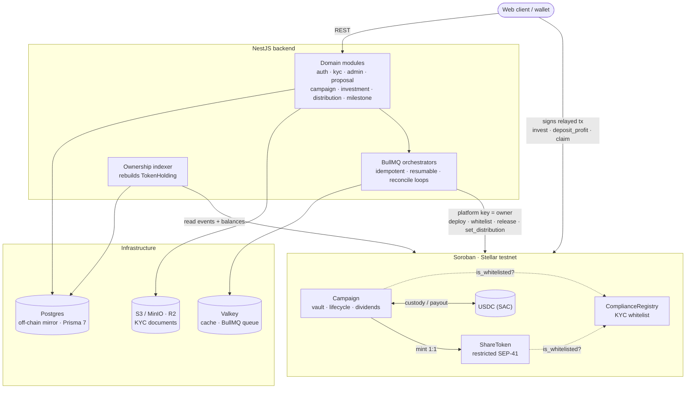

# Creon

> **Permissioned, self-custodial crowdfunding rails for Indonesian UMKM, on Stellar.**
>
> `NestJS` · `Stellar / Soroban` · `Prisma + Postgres` · `BullMQ + Valkey` · **contracts live & e2e-verified on testnet**

Creon is a web3 crowdfunding platform (_urun dana_) that lets Indonesian micro, small,
and medium enterprises (**UMKM**) raise capital from many investors — and pays returns
back as on-chain **dividends** (_bagi hasil_), not buyback. Entrepreneurs submit funding
proposals; admins run KYC and approve them; approved proposals become on-chain campaigns
that KYC'd investors fund with USDC. This repository is the **backend** (NestJS) plus the
three **Soroban smart contracts** that hold the money, mint the shares, and enforce the
rules. Built for the **Stellar APAC Hackathon 2026**.

The on-chain layer has its own deep-dive: [`contracts/README.md`](contracts/README.md).

## Why this matters

UMKM are ~60% of Indonesia's GDP yet are chronically under-banked. Equity crowdfunding
exists on paper, but it runs on **trust in an intermediary**: investors must believe a
platform is holding funds honestly, distributing profits fairly, and only admitting
KYC'd participants. Creon replaces that trust with **on-chain guarantees**:

- **Custody is transparent.** Investor USDC sits in the campaign contract, not a company
  bank account. Release to the business is gated by pre-committed milestones, not goodwill.
- **Dividend math can't be faked.** Payouts are pinned to a Merkle root posted on-chain;
  the backend computes the split but **cannot forge who gets what**.
- **Shares are compliant by construction.** A share can only ever be held by a wallet
  that passed KYC through the platform — enforced in the token contract itself.

## How it works (end-to-end)

The full lifecycle spans the off-chain backend and the on-chain contracts:

1. **Onboard** — a user connects a Stellar wallet, signs a challenge (wallet-based auth,
   no passwords), and submits **KYC** (role-agnostic: entrepreneurs and investors use the
   same flow). An admin approves it.
2. **Propose** — an approved entrepreneur drafts and submits a **funding proposal**
   (goal, lock period, milestone breakdown). Off-chain only, still just a draft.
3. **Approve → deploy** — an admin approves the proposal. The backend materializes a
   `Campaign` mirror and **deploys a per-campaign `ShareToken` + `Campaign`** on Soroban,
   then wires them (`set_minter`) — as an idempotent, resumable background job.
4. **Whitelist sync** — every KYC approval is synced into the on-chain
   `ComplianceRegistry`, so only KYC'd wallets can hold shares.
5. **Invest** — a whitelisted investor funds the campaign with **USDC** and receives
   **restricted shares 1:1**. Funds stay in the contract's custody.
6. **Release** — once fully funded, the business receives capital in **pre-committed,
   sequential milestone chunks** (hybrid: on-chain enforcement + off-chain investor
   voting weighted by share balance).
7. **Distribute** — the business deposits profit; the backend snapshots holdings, builds
   a **Merkle tree**, and posts the root on-chain; investors **pull dividends** with a
   proof via `claim()`.

## Architecture



The database is an **off-chain mirror** of on-chain state (contract addresses + tx
hashes). Every chain-touching workflow — campaign deploy, KYC whitelist sync, dividend
distribution — is a **BullMQ orchestrator**: an idempotent, resumable state machine with
a periodic reconcile loop that re-drives any unfinished work, so a lost queue job or a
restart never leaves the chain and the DB out of sync. The **ownership indexer** closes
the loop the other way, polling contract events and reading fresh on-chain balances into
`TokenHolding` (SEP-41 isn't enumerable on-chain).

## What's built

Persistence, wallet-auth, KYC + admin approval, entrepreneur proposals, **on-chain
campaign deploy**, **KYC whitelist sync**, investment recording, the **ownership
indexer**, the **dividend distribution + claim flow** (Merkle snapshots), and
**milestone-gated release** are implemented, each with colocated unit tests. The three
Soroban contracts are deployed to **testnet** and were verified end-to-end on-chain
(2026-07-02).

Remaining work is post-hackathon hardening and a full on-chain e2e run (needs a funded
`STELLAR_PLATFORM_SECRET`). **Honesty note:** the recorded `Campaign` WASM hash predates
the milestone constructor change (it gained `milestone_amounts`), so milestone release is
implemented + unit-tested with a Campaign WASM redeploy pending — same caveat as
[`contracts/README.md`](contracts/README.md).

## Backend module map

Each domain module lives under [`src/`](src) with colocated `*.spec.ts` tests.

| Module | Responsibility |
|---|---|
| [`auth`](src/auth) | Wallet-based, JWT-stateless auth: challenge → sign → verify Stellar signature. Manual guards (no passport). |
| [`kyc`](src/kyc) | Role-agnostic KYC submission (identity + ID card / selfie to a private bucket); one `KycProfile` per user. |
| [`admin`](src/admin) | Admin review of KYC and proposals; approve/reject/revoke. Proposal approval triggers the on-chain deploy. |
| [`proposal`](src/proposal) | Entrepreneur funding proposals (draft → submit), owner-scoped. |
| [`campaign`](src/campaign) | Campaign mirror + the `campaign-deploy` orchestrator (ShareToken + Campaign deploy, `set_minter`, go-live). |
| [`investment`](src/investment) | Records investments via a prepare/submit relay (the investor signs `invest`). |
| [`distribution`](src/distribution) | Dividend orchestrator: snapshot holdings → Merkle tree → `set_distribution` → investor `claim()`. |
| [`milestone`](src/milestone) | Staged fund release: on-chain `release_milestone` + off-chain weighted voting (quorum + majority). |
| [`indexer`](src/indexer) / [`holding`](src/holding) | Poll contract events + read balances to rebuild `TokenHolding`; serve current ownership. |
| [`soroban`](src/soroban) | Soroban RPC + transaction-building wrapper; the platform key that owns every contract. |
| [`prisma`](src/prisma) · [`cache`](src/cache) · [`storage`](src/storage) | Infra wrappers: Postgres (Prisma 7 + pg adapter), Valkey, S3-compatible object store. |

See [`CLAUDE.md`](CLAUDE.md) for the full architecture narrative and gotchas.

## Repository layout

```
creon-backend/
├─ src/                 NestJS backend (module-per-domain, see table above)
├─ contracts/           Soroban smart contracts — standalone Cargo workspace
│  ├─ compliance-registry/   singleton KYC whitelist
│  ├─ share-token/           restricted SEP-41 share token
│  ├─ campaign/              vault + lifecycle + Merkle dividends
│  └─ deployments/testnet.json   live addresses + WASM hashes
├─ prisma/              schema (11 models) + migrations + seed
├─ docs/                PROJECT / ARCHITECTURE / SMART_CONTRACT_PLAN / FRONTEND_FLOWS / openapi.yaml
├─ docker-compose.yml   Postgres 16 · Valkey 8 · MinIO (+ bucket init)
└─ CLAUDE.md            engineering guide
```

The contracts are a **standalone Cargo workspace**, intentionally kept out of the
pnpm/Nest build — see [`contracts/README.md`](contracts/README.md) for the on-chain
deep-dive (novelty, trust properties, testnet artifacts, deploy).

## Tech stack

| Layer | Choice |
|---|---|
| Runtime / framework | Node.js · NestJS 11 (module-per-domain) · pnpm |
| Database / ORM | Postgres 16 · Prisma 7.8 (driver adapter `@prisma/adapter-pg`) |
| Cache / queue | Valkey 8 (`@valkey/valkey-glide`) · BullMQ 5 |
| Object storage | S3-compatible — MinIO (dev) / Cloudflare R2 (prod) |
| Chain / SDK | Stellar · Soroban RPC (`@stellar/stellar-sdk`) + sig-verify (`@stellar/stellar-base`) |
| Smart contracts | Rust · `soroban-sdk` 26 · OpenZeppelin Stellar (`stellar-tokens`/`-access`/`-macros`) |

## Getting started

**Prerequisites:** Node.js, [pnpm](https://pnpm.io), and Docker (for Postgres / Valkey /
MinIO).

```bash
pnpm install
docker compose up -d        # Postgres 16, Valkey 8, MinIO (+ bucket init)

pnpm prisma:generate        # REQUIRED — the Prisma client is generated to
                            # generated/ (gitignored); build & tests fail without it
pnpm prisma:migrate         # apply migrations
pnpm db:seed                # seed reference data

cp .env.example .env        # then fill in the Stellar / storage keys

pnpm start:dev              # watch mode  (pnpm build && pnpm start:prod for production)
```

`.env.example` documents every required key (`DATABASE_URL`, the `STELLAR_*` platform
key + network, `COMPLIANCE_REGISTRY_ADDRESS`, `*_WASM_HASH`, `USDC_CONTRACT_ADDRESS`, the
`R2_*` storage keys). The app boots without a `STELLAR_PLATFORM_SECRET` for all non-chain
work — the keypair is built lazily.

## Testing

```bash
pnpm test                   # all unit tests (*.spec.ts, jest)
pnpm test path/to/x.spec.ts # a single file
pnpm test:e2e               # e2e (test/jest-e2e.json)
pnpm test:cov               # coverage
```

Every service and guard ships a colocated `*.spec.ts`. The Soroban contracts are tested
separately from `contracts/` (`cargo test` — 18 unit/integration tests, all green); see
[`contracts/README.md`](contracts/README.md).

## Docs

- [`docs/ARCHITECTURE.md`](docs/ARCHITECTURE.md) — decisions, domain invariants, roadmap.
- [`docs/PROJECT.md`](docs/PROJECT.md) — domain narrative.
- [`docs/SMART_CONTRACT_PLAN.md`](docs/SMART_CONTRACT_PLAN.md) — phased on-chain build plan.
- [`docs/FRONTEND_FLOWS.md`](docs/FRONTEND_FLOWS.md) — client flows.
- [`docs/openapi.yaml`](docs/openapi.yaml) — the HTTP API surface.
- [`contracts/README.md`](contracts/README.md) — Soroban contracts deep-dive.
- [`CLAUDE.md`](CLAUDE.md) — engineering guide (commands, gotchas, conventions).
