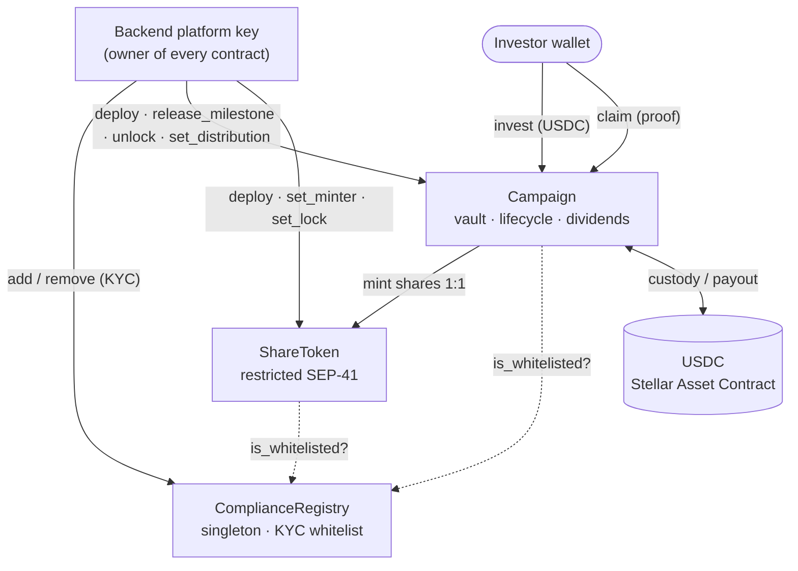

# Creon — Soroban smart contracts

> **Permissioned, self-custodial crowdfunding rails for Indonesian UMKM, on Stellar.**
>
> `Soroban` · `restricted SEP-41` · `OpenZeppelin Stellar` · `USDC (SAC)` · **live & e2e-verified on testnet**

Creon is a web3 crowdfunding platform (_urun dana_) that lets Indonesian micro, small,
and medium enterprises (**UMKM**) raise capital from many investors — and pays returns
back as on-chain **dividends** (_bagi hasil_), not buyback. These are the three
Rust/Soroban contracts that hold the money, mint the shares, and enforce the rules.
Built for the **Stellar APAC Hackathon 2026**.

This is a **standalone Cargo workspace**, intentionally kept out of the pnpm/Nest build.
Domain narrative lives in [`../docs/PROJECT.md`](../docs/PROJECT.md); decisions in
[`../docs/ARCHITECTURE.md`](../docs/ARCHITECTURE.md); the phased build in
[`../docs/SMART_CONTRACT_PLAN.md`](../docs/SMART_CONTRACT_PLAN.md).

## Why this matters

UMKM are ~60% of Indonesia's GDP yet are chronically under-banked. Equity
crowdfunding exists on paper, but it runs on trust: investors must believe an
intermediary is holding funds honestly, distributing profits fairly, and only
admitting KYC'd participants. Creon replaces that trust with **on-chain guarantees**:

- **Custody is transparent.** Investor USDC sits in the campaign contract, not a
  company bank account. Release to the business is gated by rules, not goodwill.
- **Dividend math can't be faked.** Payouts are pinned to a Merkle root posted
  on-chain; the backend can compute the split but **cannot forge who gets what**.
- **Shares are compliant by construction.** A share can only ever be held by a
  wallet that passed KYC through the platform — enforced in the token itself.

## What's novel on Stellar

- **Restricted SEP-41 as a real security token.** `ShareToken` builds on the
  OpenZeppelin `stellar-tokens` `Base` and layers an on-chain KYC gate at **both**
  mint and transfer, plus a transfer lock. A share literally cannot land in a
  non-whitelisted wallet — by mint or by secondary transfer.
- **Trustless, pull-based dividends.** The business deposits profit; the platform
  posts one Merkle root; each investor `claim`s with a proof the contract verifies
  on-chain (commutative SHA-256). No trusted disbursement, no per-holder push tx.
- **Milestone-gated staged release.** Funds are released to the business only after
  the goal is fully met, in **pre-committed on-chain chunks**, **sequentially**, once
  each — enforced by the contract. _Which_ milestone unlocks and _when_ is decided by
  off-chain investor voting weighted by share balance (hybrid design).
- **Composable, dependency-light.** Cross-contract calls use minimal
  locally-declared `#[contractclient]` interfaces (no inter-crate runtime deps), and
  USDC is any Stellar Asset Contract (SAC) via the SDK's `token::TokenClient`.

## Architecture



One `ComplianceRegistry` is deployed per platform; a fresh `ShareToken` + `Campaign`
pair is deployed per approved campaign. The backend's single platform key is the
`owner` of every contract and the only writer of the whitelist and lifecycle actions.

## Contracts

| Crate | Kind | Responsibility & on-chain guarantee |
|---|---|---|
| [`compliance-registry`](./compliance-registry) | singleton | KYC whitelist: `add` / `remove` / `is_whitelisted`, owner-gated and **idempotent** (re-adds are no-ops → safe retries). The backend (platform key = owner) is the only writer, so the website is the sole path onto the whitelist. |
| [`share-token`](./share-token) | per-campaign | Restricted SEP-41 share token on the OpenZeppelin `stellar-tokens` `Base`. `mint` is minter-only (the `Campaign`) and requires a whitelisted recipient; `transfer` / `transfer_from` require the recipient whitelisted **and** the token unlocked. Starts **locked**; shares are **non-burnable**. |
| [`campaign`](./campaign) | per-campaign | Merged vault + lifecycle + distribution: `invest` (whitelist-gated USDC custody + 1:1 mint), `release_milestone(index)` (sequential, once-only, gated on full funding), `unlock`, `deposit_profit`, `set_distribution(merkle_root)`, `claim(proof)` with on-chain Merkle verification. |

Folding vault + distribution into `Campaign` cuts per-campaign deploys from three
instances to two.

## On-chain trust & security properties

| Property | How the contract enforces it |
|---|---|
| Only KYC'd wallets can hold shares | `mint` **and** `transfer`/`transfer_from` call `registry.is_whitelisted` and revert otherwise ([`share-token/src/lib.rs`](./share-token/src/lib.rs)) |
| Only the platform can whitelist | `add`/`remove` are `#[only_owner]`; owner = backend platform key ([`compliance-registry/src/lib.rs`](./compliance-registry/src/lib.rs)) |
| Shares only mintable by the campaign | `mint` requires `minter.require_auth()`, minter set once by the owner |
| Platform can't over-release funds | milestone amounts are pinned at construction and validated to **sum to the goal**; `release_milestone` is `#[only_owner]`, gated on `raised >= goal`, and advances a **sequential once-only** `NextMilestone` counter ([`campaign/src/lib.rs`](./campaign/src/lib.rs)) |
| Platform can't forge dividend amounts | `claim` recomputes the leaf hash and verifies a **commutative SHA-256 Merkle proof** against the posted root ([`campaign/src/merkle.rs`](./campaign/src/merkle.rs)); each `(id, index)` is claimable once |
| Investor pulls funds directly | `invest`/`deposit_profit`/`claim` each `require_auth()` on the acting wallet — the platform key can't move a user's USDC |
| No silent share destruction | shares are non-burnable; only `mint`/`transfer` events exist for the off-chain ownership indexer |

## Deployed on testnet

Live artifacts (source of truth: [`deployments/testnet.json`](./deployments/testnet.json)):

| Item | Value |
|---|---|
| Network | `testnet` (`Test SDF Network ; September 2015`) |
| RPC | `https://soroban-testnet.stellar.org` |
| `ComplianceRegistry` (singleton) | `CDDYCTY4BP7RMNDT5SQQMOHS6FZ5MKVPB4LIVON6MONBD2L6GWCJZ2YF` |
| `ShareToken` WASM hash | `ae06cdbb78077ef8557d86778ffe5a2a2f5d08829245b61a76ad8f93944571fb` |
| `Campaign` WASM hash | `462eb8f08bbd4f19b1c67e7b278aadf507b2a661455cb81a368a954e794a51aa` |
| USDC (test SAC) | `CA6NVKD2EVIK73B4YH6JO4XKA2GLGTN222VTOGXAZVNT5QHKLAT3O7N3` (`USDC:GDXTJXOS…`) |
| Deployer / platform owner | `GDXTJXOSJOEHZ6VLIYB35ON2YM3FYH6AYIFJ7YHFNCANALD35HTXZ6MR` |

**Verified end-to-end on testnet (2026-07-02):** the core flow — non-whitelisted
`invest()` reverts, a whitelisted investor receives shares via gated `mint`, and a
forged Merkle proof on `claim()` is rejected — passed on-chain against these
artifacts. Per-campaign `ShareToken` + `Campaign` instances are deployed from the
uploaded WASM hashes by the backend (Phase 2 orchestration).

> **Note on the milestone release:** the staged `release_milestone(index)` feature
> (Phase 7) is implemented and unit-tested, but changed the `Campaign` constructor
> signature (it gained `milestone_amounts: Vec<i128>`). The recorded `Campaign` WASM
> hash above is the pre-milestone build; a `stellar contract build` + re-upload is
> pending before milestone-enabled campaigns go on-chain. Existing testnet campaigns
> keep running under the deployed WASM.

## Toolchain

- Rust (stable) with the `wasm32v1-none` target
- [`stellar` CLI](https://developers.stellar.org/docs/tools/cli) 27+
- OpenZeppelin `stellar-tokens` / `stellar-access` / `stellar-macros` `0.7.2`
  (require `soroban-sdk` `26`), pinned in the root [`Cargo.toml`](./Cargo.toml).

## Build & test

```bash
cargo test             # 18 unit/integration tests, all green
stellar contract build # -> target/wasm32v1-none/release/{compliance_registry,share_token,campaign}.wasm
```

Test coverage spans the security surface, not just happy paths — **18 tests** across
the three crates (11 `campaign`, 3 `share-token`, 4 `compliance-registry`):

- **Registry:** add → whitelisted, add idempotency, remove revokes, non-owner add rejected.
- **ShareToken:** mint requires a whitelisted recipient, transfer blocked while locked,
  transfer after unlock still whitelist-gated.
- **Campaign:** invest happy-path + non-whitelisted revert, sequential milestone
  release, out-of-order / pre-funding / double-release reverts, constructor
  sum-mismatch revert, unlock enables transfers, and `claim` valid-proof pays while
  forged & double claims are rejected.

The `campaign` suite includes a Rust-emitted **Merkle test vector**
(`print_merkle_test_vector`) that pins the exact leaf/tree encoding — the backend's
tree builder is tested byte-for-byte against it, so on-chain verification and the
off-chain snapshot can never drift.

## Deploy (testnet)

Recorded addresses + WASM hashes live in [`deployments/testnet.json`](./deployments/testnet.json).

```bash
# 1. funded deployer identity (also the platform owner)
stellar keys generate creon-deployer --network testnet --fund
DEP=$(stellar keys address creon-deployer)

# 2. build, then deploy the singleton registry + upload the per-campaign WASM
stellar contract build
REG=$(stellar contract deploy --wasm target/wasm32v1-none/release/compliance_registry.wasm \
  --source creon-deployer --network testnet -- --owner "$DEP")
SHARE_HASH=$(stellar contract upload --wasm target/wasm32v1-none/release/share_token.wasm \
  --source creon-deployer --network testnet)
CAMPAIGN_HASH=$(stellar contract upload --wasm target/wasm32v1-none/release/campaign.wasm \
  --source creon-deployer --network testnet)

# 3. test USDC (a Stellar Asset Contract)
USDC=$(stellar contract asset deploy --asset "USDC:$DEP" --source creon-deployer --network testnet)
```

Per-campaign `ShareToken` + `Campaign` instances are deployed from the uploaded WASM
hashes (`stellar contract deploy --wasm-hash <hash> -- <constructor args>`); the
`Campaign` constructor takes `(owner, token, registry, usdc, business, goal,
lock_period, milestone_amounts)`. The backend automates this per approval, idempotently.

## Backend integration

The backend consumes `complianceRegistryAddress`, `shareTokenWasmHash`,
`campaignWasmHash`, and `usdcSacAddress` — see the `COMPLIANCE_REGISTRY_ADDRESS`,
`*_WASM_HASH`, `USDC_CONTRACT_ADDRESS`, and `STELLAR_*` keys in
[`../.env.example`](../.env.example). It deploys the per-campaign contracts on proposal
approval, syncs KYC approvals into the on-chain whitelist, records investments, indexes
share ownership, and orchestrates dividend distribution — all as idempotent, resumable
jobs. See the backend guide in [`../CLAUDE.md`](../CLAUDE.md).
